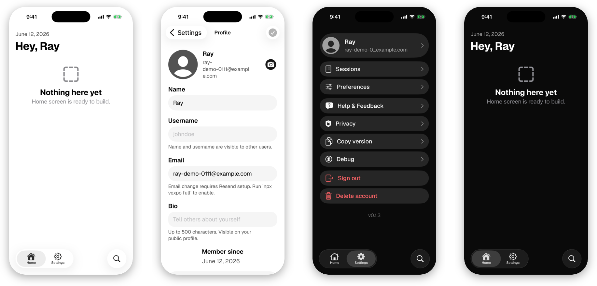

# vexpo

[](https://www.npmjs.com/package/@ramonclaudio/create-vexpo)
[](https://www.npmjs.com/package/@ramonclaudio/vexpo)
[](https://opensource.org/licenses/MIT)

vexpo is an Expo SDK 56 iOS template with Convex and Better Auth wired in, plus a CLI that links your Convex deployment and syncs with EAS to get a new app running in minutes.

<p align="center">
  
</p>

```bash
npm create @ramonclaudio/vexpo@latest my-app
cd my-app

npx vexpo lite          # Convex + Better Auth, simulator-ready in about a minute
```

Run it in two terminals:

```bash
npm run convex:dev      # terminal 1
npm run ios             # terminal 2
```

`lite` skips Apple, EAS, and Resend, so sign-up auto-verifies. When you're ready to ship:

```bash
npx vexpo full          # provisions Resend, Apple Sign In, EAS, rebrand wizard
npx vexpo doctor        # auth-checks every credential against the real service
```

`full` writes the env, sets Convex vars, signs the Apple JWT, runs `eas init` + `eas env:push`, then prints the `eas build` command for you to run. Add `--new` for signup walkthroughs, or `--plan` to preview the setup first.

<p align="center">
  
</p>

Two packages: [`create-vexpo`](https://www.npmjs.com/package/@ramonclaudio/create-vexpo) scaffolds the app, [`vexpo`](https://www.npmjs.com/package/@ramonclaudio/vexpo) provisions, verifies, and repairs the setup.

## What's included

- Expo SDK 56, RN 0.85, React 19. Strict TypeScript, no NativeWind.
- Every screen is SwiftUI via `@expo/ui/swift-ui`, Liquid Glass on iOS 26+, blur fallback below.
- Email, password, OTP, and Apple Sign In, with per-device session revocation and account soft-delete.
- Convex reactive queries and storage, Resend webhooks, App Attest primitives ready to wire.
- APNs push and Apple Universal Links.
- EAS builds, updates, submission, and store metadata, with ten workflows under `.eas/workflows/`. None trigger on a push to `main`.

<p align="center">
  
</p>

Screen by screen: [`templates/default/README.md`](./templates/default/README.md).

## Repo layout

```text
vexpo/
├── packages/
│   ├── create-vexpo/      # npm scaffolder
│   └── vexpo/             # operational CLI
└── templates/default/     # the Expo + Convex + Better Auth app
```

`create-vexpo` copies `templates/default/`, rewrites `package.json`, installs, inits git. `vexpo` ships as a devDependency, so `npx vexpo` resolves to the pinned version.

## Pre-reqs

- macOS and Xcode
- Bun or Node 20+
- Apple Developer Program ($99/yr), when you're ready to ship
- A domain you control DNS for (Resend sending domain)

## Docs

- [`templates/default/README.md`](./templates/default/README.md): the app, screen by screen.
- [`SECURITY.md`](./SECURITY.md): threat model, webhook verification, OTA signing, secret rotation.
- [`CHANGELOG.md`](./CHANGELOG.md): release history.

Working on vexpo itself? See [`CONTRIBUTING.md`](./CONTRIBUTING.md). Bugs go to [GitHub Issues](https://github.com/ramonclaudio/vexpo/issues).

## License

MIT
