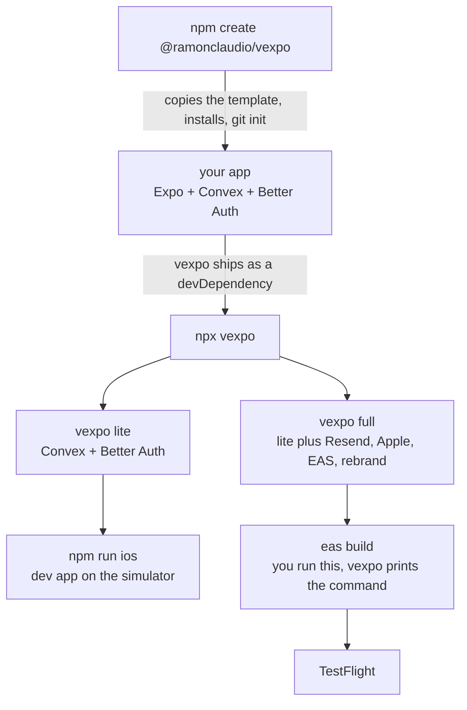

# vexpo

[](https://www.npmjs.com/package/@ramonclaudio/create-vexpo)
[](https://www.npmjs.com/package/@ramonclaudio/vexpo)
[](https://github.com/ramonclaudio/vexpo/actions/workflows/check.yml)
[](https://scorecard.dev/viewer/?uri=github.com/ramonclaudio/vexpo)
[](https://opensource.org/licenses/MIT)

[](https://launch.expo.dev/?github=https://github.com/ramonclaudio/vexpo)

Vexpo is an iOS app built on Expo SDK 57 with `@expo/ui`'s fully native SwiftUI, Convex set up as the backend, Better Auth wired in for authentication, and Resend for email.

<p align="center">
  
</p>

## Quick start

```bash
npm create @ramonclaudio/vexpo@latest my-app
cd my-app

npx vexpo lite          # sets up Convex and Better Auth
npx vexpo lite --new    # same, plus a Convex signup walkthrough if you don't have an account
```

Then run the backend and the app in two terminals.

```bash
npm run convex:dev      # terminal 1
npm run ios             # terminal 2
```

`lite` skips Apple, EAS and Resend, so sign-up auto-verifies and you're in the app right away. The app is still called Vexpo at this point. `npx vexpo rebrand` replaces the name, bundle id and everything else with yours, and `full` runs that for you so you don't have to remember.

When you're ready to ship, run `full` and then `doctor` to make sure everything actually connected.

```bash
npx vexpo full          # adds Resend, Apple Sign In, the ASC key, eas init, and rebrand
npx vexpo doctor        # checks every credential against the live service
```

`full` writes the env, sets the Convex vars, signs the Apple JWT, runs `eas init` and `eas env:push`, and creates the App Review account. Add `--new` if you still need to sign up somewhere, or `--plan` if you want to see what it's going to do first.

I tried to make vexpo as agent friendly as possible, but there are still a few steps you have to do yourself. You log in to EAS, download the App Store Connect `.p8` once, paste a Resend key, and answer the credentials wizard on the first build. Everything else runs on its own, including every build and submit after that one. The scaffold's [Ship path](./templates/default/README.md#ship-path) lists every step in order.

## How it works

`npm create` copies the template into a new folder and installs it. The `vexpo` CLI comes with it as a devDependency. `vexpo lite` sets up Convex and Better Auth so you can run the app on the simulator, and `vexpo full` adds the rest of what you need to get to TestFlight.


```mermaid
flowchart TD
    A["npm create @ramonclaudio/vexpo"] -->|"copies the template, installs, git init"| B["your app<br/>Expo + Convex + Better Auth"]
    B -->|"vexpo ships as a devDependency"| C["npx vexpo"]
    C --> D["vexpo lite<br/>Convex + Better Auth"]
    C --> E["vexpo full<br/>lite plus Resend, Apple, EAS, rebrand"]
    D --> F["npm run ios<br/>dev app on the simulator"]
    E --> G["eas build<br/>you run this, vexpo prints the command"]
    G --> H["TestFlight"]
```

- `lite` writes `.env.local` and sets the Convex env vars.
- `full` adds the Resend key and webhook, the Apple JWT, the EAS project and env, and the App Review account.
- Every step is saved in `.setup-state.json`, so if something fails halfway you can just run it again and it picks up where it left off. `doctor` checks the real services, not that file.

## Start with an AI agent

I set this up so an agent can run every command in this README. `rebrand` takes all its inputs as flags with `-y`, so nothing stops to ask a question. Scaffold the project, open it in your agent, and paste this.

```text
Set up this fresh vexpo scaffold as my app. Collect my identity inputs (app
name, bundle id, my name, Expo slug, review email, URLs), run
`npx vexpo rebrand -y` with full flags, then `npx vexpo lite`, verify with
typecheck + lint + format:check + test, and commit. README.md has the details,
including the Ship path for when I say ship.
```

The scaffold's [`README.md`](./templates/default/README.md#setup) has the longer version of this prompt, the ship path with each step marked human or agent, and the code conventions I'd like the agent to follow.

<p align="center">
  
</p>

## What's included

- Expo SDK 57 with React Native 0.86 and React 19, all in strict TypeScript.
- Every screen is SwiftUI through `@expo/ui/swift-ui`, with Liquid Glass on iOS 26 and later and a blur fallback on anything older.
- VoiceOver, Voice Control and Dynamic Type work on every screen. Loading and error states get announced, related rows read as one item, icons scale with the text setting, and the app switcher snapshot hides emails and session IPs. I only use released versions of `@expo/ui` here, nothing unreleased.
- Email, password, OTP and Apple Sign In. You can sign out any one device, and deleting your account gives you 30 days to undo it.
- Accounts are optional. "Continue as guest" gives you a real session, and if you sign up later your guest data moves to the account. Set `GUEST_MODE=false` on the Convex deployment if you'd rather require an account.
- Convex live queries and storage, plus Resend delivery webhooks.
- APNs push and Apple Universal Links.
- EAS builds, updates, submission and store metadata, with nine workflows under `.eas/workflows/`. None of them run when you push to `main`, so nothing ships by accident.

<p align="center">
  
</p>

## Repository layout

```text
vexpo/
├── packages/
│   ├── create-vexpo/      # npm scaffolder
│   └── vexpo/             # CLI
└── templates/default/     # the Expo + Convex + Better Auth app
```

`create-vexpo` copies `templates/default/`, rewrites `package.json`, installs, and inits git. The `vexpo` CLI is a devDependency of the new app, so `npx vexpo` runs whatever version is in your `package.json`.

## Prerequisites

You need these two on your machine. `eas-cli` and the `convex` CLI run through npx, so there's nothing else to install globally.

- macOS and Xcode. The template is iOS only for now.
- Bun, or Node 22.12 or newer.

You only need each account once you get to the step that uses it. Convex is the only one you need before you ship.

| Stage                   | Account                                     | Cost                  |
| ----------------------- | ------------------------------------------- | --------------------- |
| `vexpo lite` (dev app)  | Convex                                      | free                  |
| `vexpo full` (shipping) | Expo (EAS builds, env, submit)              | free tier covers this |
| `vexpo full` (shipping) | Apple Developer Program + App Store Connect | $99/yr                |
| Email (OTP, reset)      | Resend + a domain you control DNS for       | free tier covers this |

Run `npx convex login` and `npx eas-cli login` once before setup. Setup tells you if either one is missing, and `--new` on `lite` or `full` helps you sign up for anything you don't have yet. Apple also needs a one-time ASC API key download, a `.p8` with the App Manager role, and the scaffold's [Ship path](./templates/default/README.md#ship-path) has that step too.

## Docs

- [`templates/default/README.md`](./templates/default/README.md) is the app itself, screen by screen.
- [`docs/troubleshooting.md`](./docs/troubleshooting.md) has the Apple, EAS, Convex and Expo failures I ran into and how I got past them.
- [`SECURITY.md`](./SECURITY.md) has the threat model, webhook verification, OTA signing and secret rotation.
- [`CHANGELOG.md`](./CHANGELOG.md) is the release history.

If you want to work on vexpo itself, [`CONTRIBUTING.md`](./CONTRIBUTING.md) has what you need. If you hit a bug or have an idea, open an [issue](https://github.com/ramonclaudio/vexpo/issues). I've been wrong about this stuff before, so I'd rather hear it.

## License

MIT
