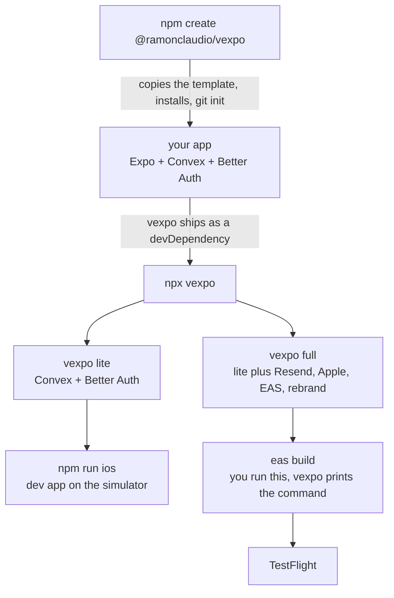
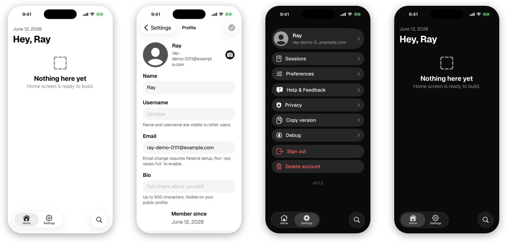

# vexpo

[](https://www.npmjs.com/package/@ramonclaudio/create-vexpo)
[](https://www.npmjs.com/package/@ramonclaudio/vexpo)
[](https://github.com/ramonclaudio/vexpo/actions/workflows/check.yml)
[](https://scorecard.dev/viewer/?uri=github.com/ramonclaudio/vexpo)
[](https://opensource.org/licenses/MIT)

vexpo is a template for iOS apps built on Expo SDK 57 and designed entirely with SwiftUI (`@expo/ui`), with Convex, Better Auth, and Resend wired in.

<p align="center">
  
</p>

```bash
npm create @ramonclaudio/vexpo@latest my-app
cd my-app

npx vexpo lite          # provisions Convex and Better Auth
npx vexpo lite --new    # same, plus a Convex signup walkthrough if you don't have one
```

Run it in two terminals:

```bash
npm run convex:dev      # terminal 1
npm run ios             # terminal 2
```

`lite` skips Apple, EAS, and Resend, so sign-up auto-verifies. The app boots as Vexpo until `npx vexpo rebrand` swaps in your identity by rewriting every branded file, and `full` runs that rebrand as part of setup. When you're ready to ship:

```bash
npx vexpo full          # adds Resend, Apple Sign In, the ASC key, eas init, and rebrand
npx vexpo doctor        # auth-checks every credential against the service
```

`full` writes the env, sets Convex vars, signs the Apple JWT, runs `eas init` + `eas env:push`, and seeds the App Review account. Add `--new` for signup walkthroughs, or `--plan` to preview the setup first.

Only four steps need you. You log in to EAS, download the App Store Connect `.p8` once, paste a Resend key, and answer the credentials wizard on the first build. Everything else runs headless, including builds and submits after the first one. The full order lives in the scaffold's [Ship path](./templates/default/README.md#ship-path).

## How it works

The three pieces are the scaffolder that copies the template, the app you end up with, and the CLI that wires that app up to the services it needs.


```mermaid
flowchart TD
    A["npm create @ramonclaudio/vexpo"] -->|"copies the template, installs, git init"| B["your app<br/>Expo + Convex + Better Auth"]
    B -->|"vexpo ships as a devDependency"| C["npx vexpo"]
    C --> D["vexpo lite<br/>Convex + Better Auth"]
    C --> E["vexpo full<br/>lite plus Resend, Apple, EAS, rebrand"]
    D --> F["npm run ios<br/>dev app on the simulator"]
    E --> G["eas build<br/>you run this, vexpo prints the command"]
    G --> H["TestFlight"]
```

- `lite` writes `.env.local` and sets the Convex env vars.
- `full` adds the Resend key and webhook, the Apple JWT, the EAS project and env, and the App Review account.
- Each step is cached in `.setup-state.json`, so re-running skips what is already done. `doctor` asks the live services instead of the cache.

## Start with an AI agent

An agent can run every one of these commands. `rebrand` takes full flags with `-y` for non-TTY runs, and the scaffold ships an [`AGENTS.md`](./templates/default/AGENTS.md) with two playbooks, one for fresh-scaffold setup and one for the ship path, with each step marked human or agent. That file also has pre-approved read-only permissions for Claude Code. Scaffold, open the project in your agent, and paste:

```text
Set up this fresh vexpo scaffold as my app. Collect my identity inputs (app
name, bundle id, my name, Expo slug, review email, URLs), run
`npx vexpo rebrand -y` with full flags, then `npx vexpo lite`, verify with
typecheck + lint + format:check + test, and commit. AGENTS.md has the details,
including the Ship path playbook for when I say ship.
```

The scaffold's own [`README.md`](./templates/default/README.md#setup) has the long-form version of this prompt.

<p align="center">
  
</p>

## What's included

- Expo SDK 57 with React Native 0.86 and React 19, all in strict TypeScript.
- Every screen is SwiftUI through `@expo/ui/swift-ui`, with Liquid Glass on iOS 26 and later and a blur fallback on anything older.
- VoiceOver, Voice Control, and Dynamic Type work on every screen. Loading and error states get announced instead of passing silently, related rows read as one stop instead of several, icons scale with the text setting, and backgrounding the app hides emails and session IPs from the app-switcher snapshot. Wired against released `@expo/ui` only.
- Email, password, OTP, and Apple Sign In, with per-device session revocation and account soft-delete.
- An account is optional. "Continue as guest" gets you into the app with a real session, and signing up later carries the guest's data onto the account. Set `GUEST_MODE=false` on the Convex deployment to require an account instead.
- Convex reactive queries and storage, plus Resend delivery webhooks.
- APNs push and Apple Universal Links.
- EAS builds, updates, submission, and store metadata, with nine workflows under `.eas/workflows/`. None trigger on a push to `main`.

<p align="center">
  
</p>

## Repository layout

```text
vexpo/
├── packages/
│   ├── create-vexpo/      # npm scaffolder
│   └── vexpo/             # CLI
└── templates/default/     # the Expo + Convex + Better Auth app
```

`create-vexpo` copies `templates/default/`, rewrites `package.json`, installs, and inits git. The `vexpo` CLI ships as a devDependency, so `npx vexpo` resolves to the pinned version.

## Prerequisites

The local tools come down to these two, since `eas-cli` and the `convex` CLI come through the project (npx fetches them) with no global installs:

- macOS and Xcode (iOS-only)
- Bun or Node 22.12+

Accounts come in by the stage that needs them, and only Convex is required before you ship:

| Stage                   | Account                                     | Cost                  |
| ----------------------- | ------------------------------------------- | --------------------- |
| `vexpo lite` (dev app)  | Convex                                      | free                  |
| `vexpo full` (shipping) | Expo (EAS builds, env, submit)              | free tier covers this |
| `vexpo full` (shipping) | Apple Developer Program + App Store Connect | $99/yr                |
| Email (OTP, reset)      | Resend + a domain you control DNS for       | free tier covers this |

Both CLIs need a one-time login before provisioning. Run `npx convex login` and `npx eas-cli login`. Setup's Prerequisites section flags whichever is missing, and `--new` on `lite` or `full` walks each signup you don't have yet. The Apple side also needs a one-time ASC API key download (`.p8`, App Manager role), which the scaffold's [Ship path](./templates/default/README.md#ship-path) covers in order.

## Docs

- [`templates/default/README.md`](./templates/default/README.md): the app, screen by screen.
- [`docs/troubleshooting.md`](./docs/troubleshooting.md): the common Apple, EAS, Convex, and Expo failure modes and their fixes.
- [`SECURITY.md`](./SECURITY.md): threat model, webhook verification, OTA signing, secret rotation.
- [`CHANGELOG.md`](./CHANGELOG.md): release history.

Working on vexpo itself? See [`CONTRIBUTING.md`](./CONTRIBUTING.md). Bugs go to [GitHub Issues](https://github.com/ramonclaudio/vexpo/issues).

## License

MIT
